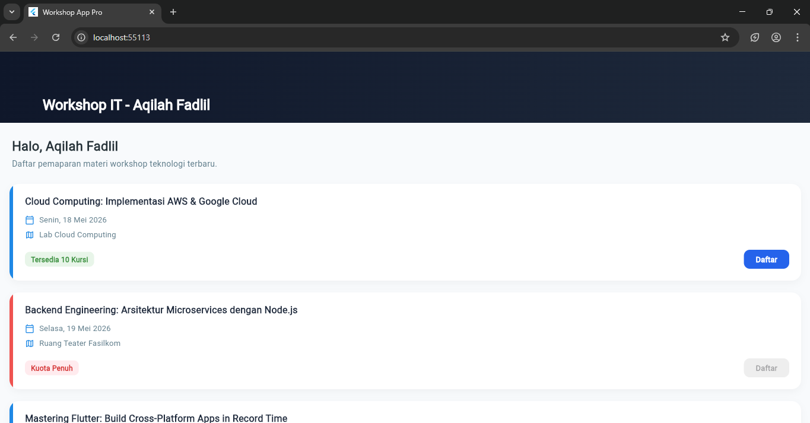

# 231011403413_aqilahfadlil_06TPLE008_MP_2026
# Dokumentasi UI/UX - Workshop IT App

Dokumentasi ini menjelaskan konsep desain dan implementasi antarmuka pengguna pada aplikasi Workshop IT (Aqilah Fadlil).

---

## 1. Sketsa Layout
Aplikasi ini menggunakan pendekatan **Sliver-based Layout** untuk menciptakan pengalaman pengguna yang dinamis dan modern.

*   **Header (SliverAppBar):** Area navigasi yang fleksibel. Menggunakan gradasi warna gelap (`0xFF0F172A`) dan memiliki efek *pinned*, sehingga tetap terlihat saat pengguna melakukan scroll.
*   **Greeting Section (SliverToBoxAdapter):** Bagian sapaan personal "Halo, Aqilah Fadlil" yang memberikan kesan *user-centric*.
*   **Content List (SliverList):** Daftar utama yang berisi komponen `KartuWorkshop`. Setiap kartu memiliki indikator status di sisi kiri untuk membedakan kategori secara cepat.

---

## 2. Alasan Pemilihan Widget
Pemilihan widget didasarkan pada efisiensi performa dan estetika:

| Widget | Alasan Pemilihan |
| :--- | :--- |
| **CustomScrollView** | Memberikan kontrol penuh atas efek scroll dan integrasi antar elemen sliver (header & list). |
| **IntrinsicHeight** | Memastikan tinggi indikator warna di sisi kiri kartu selalu presisi dengan konten di sisi kanan secara otomatis. |
| **ClipRRect** | Menjaga konsistensi visual dengan memastikan semua elemen di dalam kartu mengikuti radius sudut 16 unit. |
| **ElevatedButton** | Memberikan penekanan visual pada aksi utama (*Call to Action*) dengan state warna yang jelas antara aktif dan non-aktif. |

---

## 3. Kesalahan UI yang Dihindari
1.  **Visual Clutter (Kekacauan Visual):**
    Menghindari penggunaan warna yang terlalu ramai. Fokus diberikan pada kontras antara background yang bersih (`0xFFF8FAFC`) dengan kartu informasi agar mata pengguna tidak cepat lelah.
2.  **Ambiguity of Status (Ambiguitas Status):**
    Menghindari ketidakpastian informasi kuota. Kami menggunakan dua lapis indikator: perubahan warna (Biru/Merah) dan perubahan status tombol (Aktif/Disabled) untuk mencegah kesalahan klik pengguna.

---

## 4. Penjelasan Kenyamanan Baca (UX)
Desain ini mengutamakan keterbacaan (*Readability*) melalui beberapa prinsip:

*   **Hierarki Tipografi:** Judul workshop dibuat menonjol (Bold, size 16), sementara info detail menggunakan warna yang lebih lembut (`blueGrey`) untuk menciptakan urutan prioritas informasi.
*   **Ikonografi sebagai Penanda:** Penggunaan ikon lokasi dan kalender membantu pengguna memproses informasi lebih cepat dibandingkan hanya menggunakan teks biasa.
*   **Negative Space (Ruang Kosong):** Penggunaan margin dan padding yang luas (20 unit) memberikan "napas" pada setiap elemen sehingga informasi tidak terlihat berhimpitan.
*   **Kontras Tinggi:** Penggunaan teks gelap di atas latar belakang terang memastikan konten tetap nyaman dibaca dalam berbagai kondisi pencahayaan layar.
*   ### Preview Aplikasi

